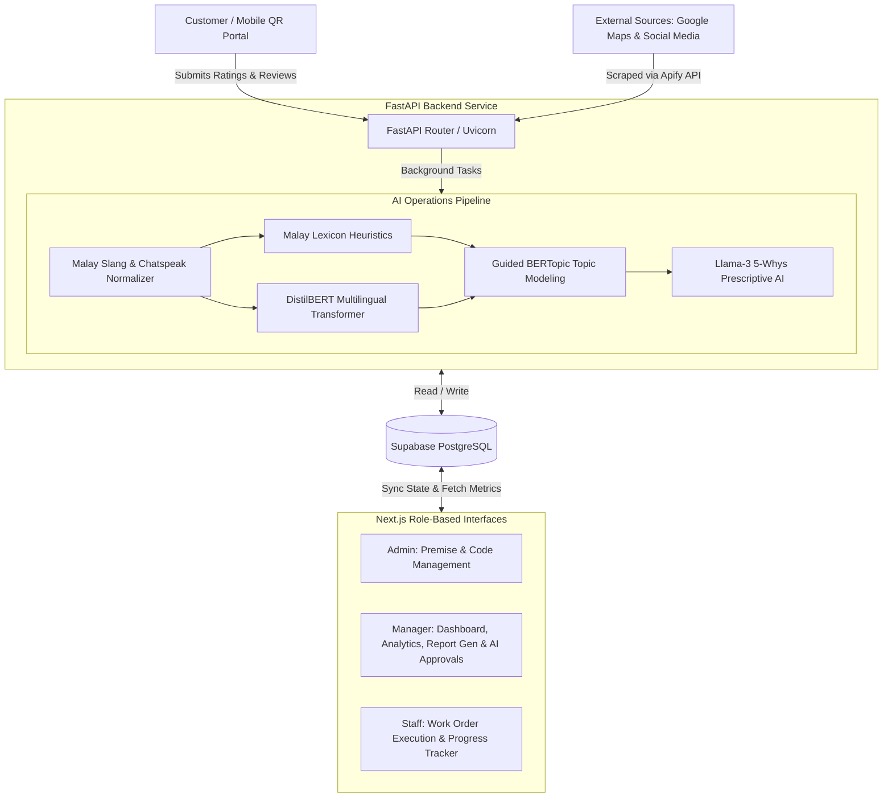

# FoodLytics System 🍽️📊
> **Enterprise-Grade AI-Driven Customer Feedback Analytics & Prescriptive Operations Platform**

FoodLytics is a full-stack, enterprise-grade business intelligence and prescriptive operations system designed for the food and beverage (F&B) industry. It leverages modern hybrid Natural Language Processing (NLP) pipelines and Large Language Models (LLMs) to capture customer feedback, identify operational issues, conduct automated Root Cause Analysis, route tasks to specific departments, and track operational progress in real-time.

Built specifically for localized Southeast Asian markets, FoodLytics features advanced normalization for Malaysian chatspeak, slang, and rojak English, ensuring high-fidelity sentiment analysis and topic clustering where generic off-the-shelf engines fail.

---

## 🏗️ System Architecture

FoodLytics utilizes a modern, decoupled architecture connecting a responsive Next.js frontend to a containerized FastAPI backend, backed by Supabase (PostgreSQL) for persistence and hosted on Microsoft Azure.



---

## 🛠️ Technology Stack

| Layer | Technology | Details |
| :--- | :--- | :--- |
| **Frontend UI** | **Next.js 16 (React 19)** | App Router, TypeScript, TailwindCSS v4, Headless UI |
| **Data Viz** | **Tremor & Recharts** | High-performance dashboard grids, charts, and metric cards |
| **Backend API** | **FastAPI** | Python 3.11+, Uvicorn web server, Pydantic data schemas |
| **Database** | **Supabase (PostgreSQL)** | Persistent storage, relational design, instant client-side connection |
| **Ingestion** | **Apify API Scrapers** | Automated scraping of Google Maps reviews, X/Twitter, and Instagram |
| **NLP Modeling** | **Guided BERTopic** | Topic clustering using `sentence-transformers`, `UMAP`, `HDBSCAN`, and `scikit-learn` |
| **Sentiment** | **Hybrid Transformer + Lexicon** | `distilbert-base-multilingual-cased` + custom Malay Lexicon rules |
| **Prescriptive AI** | **Meta-Llama-3-8B-Instruct** | Hosted via Hugging Face Inference API for Root Cause Analysis (5 Whys) |
| **IaC & DevOps** | **Terraform & GitHub Actions** | Docker container builds, Azure Container Apps, Log Analytics, Web Apps |

---

## 🧠 Core AI & NLP Pipelines

### 1. Slang Normalization Engine
Malaysian customer reviews are frequently typed in informal chatspeak (e.g., *"hauk"*, *"x sedap"*, *"rege mahei"*, *"slow giler"*). FoodLytics processes all raw feedback through a custom normalization layer:
* Collapses duplicated characters (e.g., *"sedapppp"* ➡️ *"sedap"*).
* Resolves negation phrases (e.g., *"x sedap"* ➡️ *"tidak sedap"*, *"xde adab"* ➡️ *"tiada adab"*).
* Maps local slang to standard Malay/English equivalents using a high-density, greedy multi-word dictionary to prepare clean embeddings for clustering.

### 2. Hybrid Sentiment Classifier
To achieve industry-leading classification accuracy on short-form feedback, a hybrid engine is used:
* **VADER-Style Malay Lexicon**: Calculates valence scores based on Malay adjectives, accounting for intensifiers (*"sangat"*, *"gila"*), diminishers (*"kurang"*, *"agak"*), and contrast markers (*"tapi"*, *"walaupun"*).
* **Multilingual Transformer**: Passes clean text through `lxyuan/distilbert-base-multilingual-cased-sentiments-student` for semantic context evaluation.
* **Rating Calibration**: Calibrates the AI model confidence dynamically when numerical star ratings (food, service, ambience) are present.

### 3. Three-Layer Diagnostic Topic Modeling
FoodLytics solves the common issue of BERTopic clustering failing on very short text (2–4 words) by structuring topic modeling in a 3-layer priority stack:
1. **Layer 1: Rule-Based Classifier (Fast Path)**: Deterministically routes reviews containing clear keywords directly to standard categories (*Layanan Staf*, *Kualiti Makanan*, *Masa Menunggu*, *Kebersihan Kedai*, etc.). Captures ~70% of standard short reviews with 100% accuracy and zero token cost.
2. **Layer 2: Text Normalization**: Runs Malay chatspeak/slang normalization.
3. **Layer 3: Guided BERTopic**: Any reviews not captured by Layer 1 are embedded using `sentence-transformers` and clustered using Guided BERTopic with seed topics and KeyBERT representations.

### 4. Prescriptive Strategic AI (Root Cause Analysis)
For negative feedback clusters, the system automatically triggers a prescriptive analysis using Llama-3:
* **Root Cause (5 Whys)**: Recursively asks *"Why"* to trace the symptom (e.g., pelayan kasar) back to the systemic operational bottleneck (e.g., no peak-demand forecasting).
* **Department Routing**: Routes tasks to Front-of-House, Kitchen (Dapur), Maintenance (Penyelenggaraan), or Management (Pengurusan).
* **KPIs & Monitoring**: Establishes target metrics and monitoring guidelines.
* **Actionable Work Orders**: Generates explicit instructions split between Staff and Managers.

---

## 👥 Role-Based Workflows

### 📱 1. Customer (Portal QR)
Customers scan a table/receipt QR code, launching a lightweight mobile-responsive feedback portal.
* Submits ratings for overall stars, food quality, staff service, and shop ambience.
* Inputs raw review text.
* On submission, the backend asynchronously triggers the NLP pipeline in a FastAPI Background Task, ensuring sub-second response times for the customer.

### 📊 2. Manager (Pengurus)
Managers handle data sync, strategic analysis, report exports, and operational decisions.
* **Aggregated Dashboard**: Tracks performance trends, platform breakdown (QR vs. Google vs. Social Media), and sentiment velocity.
* **Drill-down Analytics**: Clicks on a specific topic cluster (e.g., *"Masa Menunggu"*) to inspect the raw reviews, stars, and sentiment scores.
* **Ingestion Management**: Initiates syncing from Google Maps and social media links.
* **Prescriptive AI Review**: Evaluates AI-drafted recommendations. Can approve (*"Lulus"*), reject (*"Tolak"*), or save as draft (*"Simpan"*).
* **PDF Export**: Generates and prints comprehensive business reports directly from the dashboard.

### 🔧 3. Staff (Staf Operasi)
Frontline staff act as the hands of the operations loop.
* **Work Order Queue**: Receives recommendations approved by the Manager as structured tasks.
* **Execution Tracking**: Updates status of work orders through their lifecycle: `Baru` (New) ➡️ `Dalam Proses` (In Progress) ➡️ `Selesai` (Completed).

### ⚙️ 4. Admin
System administrators maintain the database and coordinate onboarding.
* Registers new premises (restaurants).
* Registers Manager accounts and links them to premises.
* Generates unique *Business Codes* (Kod Perniagaan) allowing staff members to sign up and automatically align with the correct restaurant premise.

---

## 📁 Repository Structure

```
FoodLytics-System/
├── backend/                  # FastAPI Backend Service
│   ├── routes/               # API Router Handlers (Admin, Analytics, Ingestion, Prescriptive, etc.)
│   ├── services/             # Core AI & Scraper Integrations (Topic modeling, Sentiment, Slang, Apify)
│   ├── models.py             # Pydantic Schemas for validation
│   ├── database.py           # Supabase DB Connection Manager
│   ├── Dockerfile            # Container configuration
│   └── requirements.txt      # Python dependencies
├── frontend/                 # Next.js 16 Web Application
│   ├── app/                  # App Router Pages & Role-based Dashboards (admin, pengurus, staf, feedback)
│   ├── components/           # Reusable UI widgets & PDF Templates
│   ├── lib/                  # Authentication Providers & Utilities
│   └── package.json          # Node dependencies
├── infrastructure/           # IaC Configuration
│   └── main.tf               # Terraform script (Azure Resource Group, Container Apps, ACR, Log Analytics)
└── .github/                  # CI/CD Workflows
    └── workflows/
        └── deploy-backend.yml # GitHub Actions workflow to build & deploy backend to Azure
```

---

## 🚀 Local Deployment Setup

### 1. Database Setup (Supabase)
1. Create a project on [Supabase](https://supabase.com/).
2. Run the SQL schema to create the following tables:
   * `tbl_pengguna` (Users)
   * `tbl_premis` (Premises/Restaurants)
   * `tbl_maklumbalas` (Customer Feedback)
   * `tbl_enjin_ai` (AI Log runs)
   * `tbl_sentimen` (Sentiment tags)
   * `tbl_topik` (Topic modeling tags)
   * `tbl_cadangan_ai` (Prescriptive recommendation cards / Work orders)

### 2. Backend Setup
1. Navigate to the backend directory:
   ```bash
   cd backend
   ```
2. Create a virtual environment and install dependencies:
   ```bash
   python -m venv venv
   source venv/Scripts/activate  # On Windows: venv\Scripts\activate
   pip install -r requirements.txt
   ```
3. Create a `.env` file from the example:
   ```env
   SUPABASE_URL=https://your-supabase-project.supabase.co
   SUPABASE_KEY=your-supabase-service-role-key
   HUGGINGFACE_API_KEY=your-huggingface-access-token
   APIFY_API_KEY=your-apify-token  # Optional: For actual Google/Social Scrapers
   FRONTEND_URL=http://localhost:3000
   ```
4. Spin up the FastAPI server:
   ```bash
   uvicorn main:app --reload --port 8000
   ```

### 3. Frontend Setup
1. Navigate to the frontend directory:
   ```bash
   cd ../frontend
   ```
2. Install dependencies:
   ```bash
   npm install
   ```
3. Create a `.env.local` file:
   ```env
   NEXT_PUBLIC_API_URL=http://localhost:8000
   ```
4. Start the local development server:
   ```bash
   npm run dev
   ```
5. Open [http://localhost:3000](http://localhost:3000) to interact with the application.

---

## 🌐 DevOps & Infrastructure (Azure Deployments)

### Terraform Setup
The backend infrastructure is defined using **Terraform** to enable repeatable, declarative cloud deployments:
1. Initialize Terraform in `/infrastructure`:
   ```bash
   cd infrastructure
   terraform init
   ```
2. Review plan and apply to provision Azure Resource Group, ACR, Log Analytics, and ACA environments:
   ```bash
   terraform plan
   terraform apply
   ```

### CI/CD Pipeline
Every push to the `main` branch triggers the GitHub Actions pipeline:
1. **Code Checkout**: Clones the repository.
2. **Azure Authentication**: Signs into Azure using secure credentials stored in GitHub Secrets.
3. **Docker Build & Push**: Automatically builds the backend Dockerfile and pushes it to Azure Container Registry (ACR).
4. **App Service Deployment**: Deploys the latest backend container image to Azure App Service / Container Apps.
